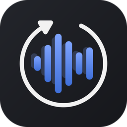
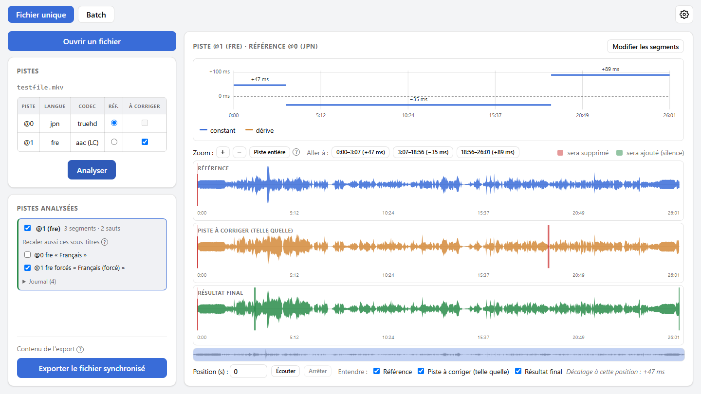
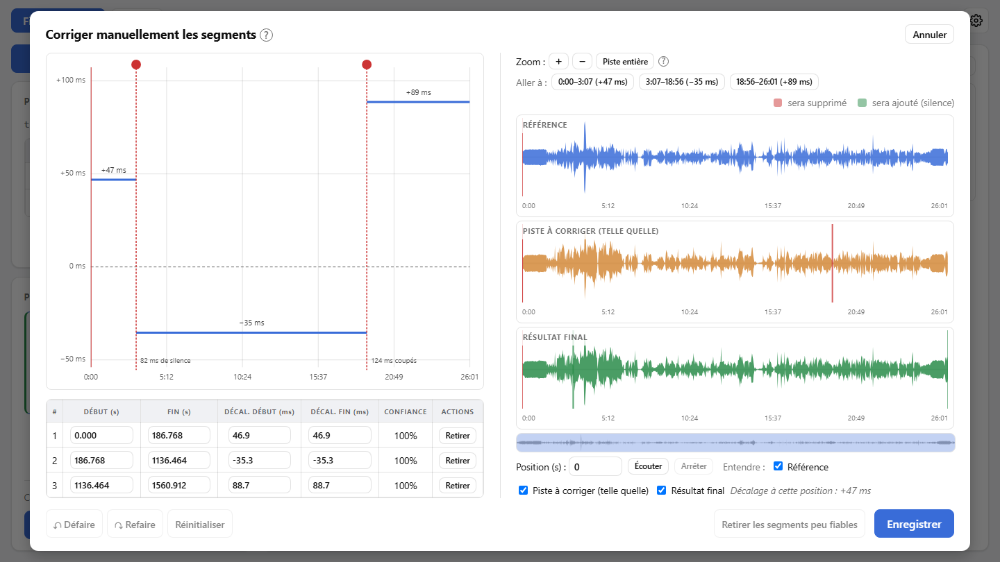

<a href="README.md">English</a> | Français

  

<h1 align="center">SyncAudio</h1>

  <b>Remet un doublage en phase avec sa vidéo</b>, en se basant sur la musique et les bruitages communs aux deux versions plutôt que sur les dialogues.

  
  
  
  

  

<picture>
  <source media="(prefers-color-scheme: dark)" srcset="docs/screenshots/main-fr-dark.png">
  
</picture>

## Pourquoi

Un doublage colle rarement à la vidéo à laquelle on l'ajoute : quelques images de retard, un décalage qui **dérive** peu à peu à cause d'une cadence différente, ou des **sauts** là où la version doublée a été montée autrement (une scène plus longue ou plus courte, une coupure pub). Se caler sur les dialogues ne marche pas, puisque ce sont justement eux qui diffèrent d'une langue à l'autre. SyncAudio compare plutôt ce que les deux versions ont en commun : musique, bruitages, ambiances.

## Fonctionnalités

- 🎯 **Détecte les trois types de décalage** : constant, dérive progressive, sauts, chacun avec un score de confiance.
- 👀 **Vérifier avant d'exporter** : formes d'onde de la référence, de la piste telle quelle et du résultat final, avec ce qui sera coupé ou comblé de silence surligné, et une écoute qui mélange les trois au choix.
- ✏️ **Corriger à la main si besoin** : glisser un segment ou une frontière, couper, retirer une fausse détection, défaire / refaire, retirer d'un clic les segments peu fiables.
- 📦 **Un export propre** : un nouveau MKV avec la vidéo, la piste de référence et les pistes corrigées ; les sous-titres texte (SRT, ASS) associés à une piste subissent les mêmes sauts et la même dérive. Le fichier d'origine n'est jamais modifié.
- 🗂️ **Une série entière en une passe** : des fichiers qui contiennent chacun les deux versions (pistes choisies par langue), ou des paires de fichiers où la piste corrigée vient d'un autre fichier (une vidéo, ou un simple fichier audio).
- 🖱️ **Glisser-déposer** : des fichiers, ou tout un dossier en mode batch (épisodes dans l'ordre des noms).
- 🌗 **Confort** : français ou anglais, thème clair ou sombre, analyses gardées sur le disque (rouvrir un fichier est immédiat), mises à jour automatiques.

## Installation

1. Télécharge `SyncAudio_x.y.z_x64-setup.exe` depuis la [dernière release](https://github.com/MarcValat/SyncAudio/releases/latest).
2. Lance-le. L'installateur n'est pas signé par un certificat, Windows SmartScreen peut donc afficher *« Windows a protégé votre ordinateur »* : clique sur **Informations complémentaires**, puis **Exécuter quand même**.

Rien d'autre à installer : le moteur d'analyse et ffmpeg sont fournis avec l'application. Quand une nouvelle version sort, l'application la propose et l'installe en un clic.

## Comment ça marche

1. **Ouvre un fichier** (ou dépose-le sur la fenêtre), choisis la piste de **référence** (celle qui est calée sur la vidéo, jamais modifiée) et les pistes **à corriger**.
2. **Analyse** : la courbe de décalage montre les segments trouvés. Écoute le résultat, et ajuste les segments à la main si quelque chose cloche.
3. **Exporte** : le fichier synchronisé est écrit dans un nouveau MKV, à côté de l'original par défaut (`Film.synced.mkv`).

<picture>
  <source media="(prefers-color-scheme: dark)" srcset="docs/screenshots/editor-fr-dark.png">
  
</picture>

## Bon à savoir

- La détection s'appuie sur le son commun aux deux versions. Sur un passage uniquement parlé (une narration sans musique ni bruitage, par exemple), elle peut se caler sur les dialogues et se tromper : un tel segment reçoit un **score de confiance bas**, signalé ⚠, à vérifier à l'écoute.
- Les sous-titres image (PGS, VobSub) ne peuvent pas être recalés segment par segment : ils sont copiés tels quels.

## Pour les développeurs

- [`engine/`](engine/README.md) : le moteur Python (détection, correction et rendu, serveur HTTP local) ; utilisable seul en ligne de commande.
- [`app/`](app/README.md) : l'application (Tauri + React/TypeScript), qui pilote le moteur ; compilation, empaquetage et publication d'une release.

## Licence

Copyright © 2026 Marc Valat. SyncAudio est un logiciel libre, distribué sous [licence publique générale GNU v3](LICENSE) : tu peux l'utiliser, l'étudier, le partager et le modifier, et toute version distribuée, modifiée ou non, doit rester sous la même licence avec son code source disponible.

L'installateur fournit aussi [FFmpeg](https://ffmpeg.org/) (une version de [gyan.dev](https://www.gyan.dev/ffmpeg/builds/), via [imageio-ffmpeg](https://github.com/imageio/imageio-ffmpeg)), que SyncAudio lance comme programme séparé. Cette version est elle aussi sous GPL v3 ; son code source est disponible auprès de FFmpeg et de gyan.dev.
