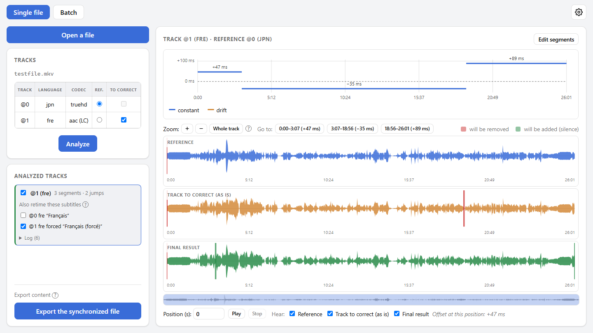
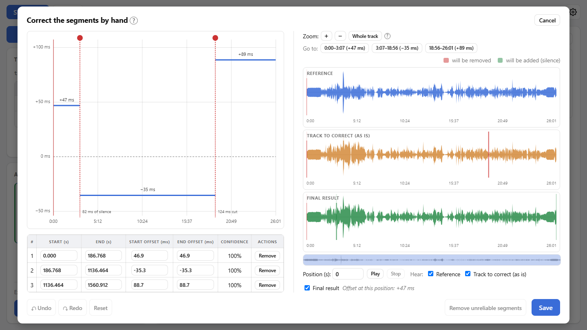

English | <a href="README.fr.md">Français</a>

  

<h1 align="center">SyncAudio</h1>

  <b>Put a dub back in sync with its video</b>, from the music and sound effects both versions share rather than from the dialogue.

  
  
  
  

  

<picture>
  <source media="(prefers-color-scheme: dark)" srcset="docs/screenshots/main-en-dark.png">
  
</picture>

## Why

A dub rarely lines up with the video it's added to: a few frames of delay, an offset that slowly **drifts** because of a different frame rate, or **jumps** where the dubbed version was cut differently (a scene longer or shorter, an ad break). Syncing on the dialogue doesn't work, since the dialogue is exactly what differs between two languages. SyncAudio compares what they have in common instead: music, sound effects, ambience.

## Features

- 🎯 **Detects all three kinds of desync**: constant offset, progressive drift, jumps, each with a confidence score.
- 👀 **Check before exporting**: waveforms of the reference, the track as it is and the final result, with what will be cut or filled with silence highlighted, and listening that mixes any of the three.
- ✏️ **Correct by hand if needed**: drag a segment or a boundary, split, remove a false detection, undo / redo, remove unreliable segments in one click.
- 📦 **A clean export**: a new MKV with the video, the reference track and the corrected tracks; the text subtitles (SRT, ASS) that go with a track get the same jumps and drift. The original file is never changed.
- 🗂️ **A whole series in one pass**: files that each hold both versions (tracks picked by language), or pairs of files where the corrected track comes from another file (a video, or a bare audio file).
- 🖱️ **Drag and drop**: files, or a whole folder in batch mode (episodes in name order).
- 🌗 **Comfort**: English or French, light or dark theme, analyses kept on disk (reopening a file is instant), automatic updates.

## Install

1. Download `SyncAudio_x.y.z_x64-setup.exe` from the [latest release](https://github.com/MarcValat/SyncAudio/releases/latest).
2. Run it. The installer isn't signed with a certificate, so Windows SmartScreen may say *"Windows protected your PC"*: click **More info**, then **Run anyway**.

Nothing else to install: the analysis engine and ffmpeg come with the app. When a new version comes out, the app offers it and installs it in one click.

## How it works

1. **Open a file** (or drop it on the window), pick the **reference** track (the one in sync with the video, never changed) and the tracks **to correct**.
2. **Analyze**: the offset curve shows the segments found. Listen to the result, and adjust the segments by hand if something's off.
3. **Export**: the synchronized file is written as a new MKV, next to the original by default (`Film.synced.mkv`).

<picture>
  <source media="(prefers-color-scheme: dark)" srcset="docs/screenshots/editor-en-dark.png">
  
</picture>

## Good to know

- Detection relies on the sound shared by both versions. Over a stretch with only voices (a narration with no music or sound effects, for instance), it can latch onto the dialogue and be off: such a segment gets a **low confidence score**, flagged ⚠, worth checking by ear.
- Image subtitles (PGS, VobSub) can't be retimed segment by segment: they are copied as they are.

## For developers

- [`engine/`](engine/README.md): the Python engine (detection, correction and render, local HTTP server); usable on its own as a command line tool.
- [`app/`](app/README.md): the app (Tauri + React/TypeScript), which drives the engine; building, packaging and publishing a release.

Both are documented in French.

## License

Copyright © 2026 Marc Valat. SyncAudio is free software, released under the [GNU General Public License v3](LICENSE): you may use, study, share and modify it, and any version you distribute, modified or not, must stay under the same license with its source code available.

The installer also ships [FFmpeg](https://ffmpeg.org/) (a [gyan.dev](https://www.gyan.dev/ffmpeg/builds/) build, through [imageio-ffmpeg](https://github.com/imageio/imageio-ffmpeg)), which SyncAudio runs as a separate program. That build is also under the GPL v3; its source code is available from FFmpeg and gyan.dev.
