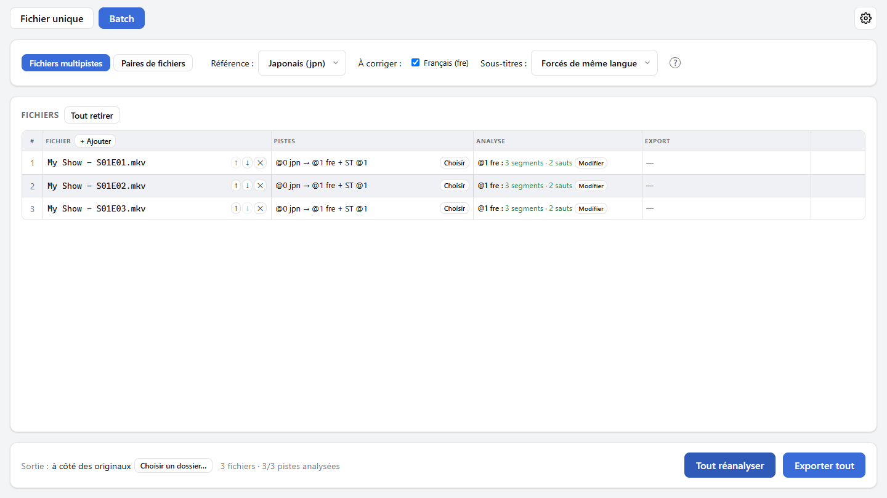

<a href="guide.md">English</a> | Français

# Guide d'utilisation

Ce guide explique comment utiliser SyncAudio, de l'ouverture d'un fichier à l'export, en fichier unique comme en mode batch. Pour l'installation, voir le [README](../README.fr.md#installation).

## Sommaire

1. [Les mots à connaître](#les-mots-à-connaître)
2. [Un fichier à la fois](#un-fichier-à-la-fois)
3. [Lire le résultat](#lire-le-résultat)
4. [Corriger les segments à la main](#corriger-les-segments-à-la-main)
5. [Exporter](#exporter)
6. [Les sous-titres](#les-sous-titres)
7. [Une série entière : le mode batch](#une-série-entière--le-mode-batch)
8. [Options](#options)
9. [Questions fréquentes](#questions-fréquentes)

## Les mots à connaître

- **Référence** : la piste audio calée sur la vidéo, en général la version originale. Elle n'est jamais modifiée : c'est elle qui sert de repère.
- **Piste à corriger** : la piste décalée, en général un doublage. C'est elle que SyncAudio recale sur la référence.
- **Décalage** : l'écart entre les deux pistes à un instant donné, en millisecondes. **+** veut dire que la piste à corriger est **en retard** sur la référence, **−** qu'elle est **en avance**.
- **Segment** : un morceau du fichier sur lequel le décalage suit une même règle. Un fichier bien calé du début à la fin n'a qu'un segment ; un fichier monté différemment en a plusieurs.
- **Constant, dérive, saut** :
  - *constant* : le décalage reste le même sur tout le segment ;
  - *dérive* : il change peu à peu (typiquement une cadence d'images différente) ;
  - *saut* : il change d'un coup entre deux segments (une scène plus longue ou plus courte dans une version, une coupure pub).
- **Confiance** : à quel point la détection d'un segment est sûre, de 0 à 100 %. En dessous de 40 %, le segment est signalé **⚠ peu fiable**.

## Un fichier à la fois

C'est le mode **Fichier unique**, pour un fichier qui contient déjà la référence et la ou les pistes à corriger (par exemple un MKV avec VO et VF).

1. **Ouvre le fichier** avec « Ouvrir un fichier », ou dépose-le sur la fenêtre.
2. **Choisis les pistes** dans le tableau :
   - colonne **Réf.** : la piste de référence (par défaut, la première) ;
   - colonne **À corriger** : les pistes à recaler (par défaut, toutes les autres).

   Pendant ce temps, « Préparation des pistes… » indique que SyncAudio lit déjà l'audio en arrière-plan, pour que l'analyse démarre plus vite.
3. **Clique sur « Analyser »**. Chaque piste cochée apparaît dans « Pistes analysées », avec un résumé : « 3 segments · 2 sauts ». Clique sur une piste pour afficher son résultat à droite.
4. **Vérifie le résultat** (voir [Lire le résultat](#lire-le-résultat)), et corrige-le à la main si besoin (« Modifier les segments »).
5. **Exporte** avec « Exporter le fichier synchronisé ».

<picture>
  <source media="(prefers-color-scheme: dark)" srcset="screenshots/main-fr-dark.png">
  
</picture>

## Lire le résultat

### Le graphe des décalages

En haut à droite, le graphe montre le décalage (verticalement) tout au long du fichier (horizontalement). La ligne pointillée « 0 ms » correspond à la référence.

- Chaque segment est un trait : **bleu** s'il est constant, **orange** s'il dérive.
- Un trait **en pointillés** est peu fiable : à vérifier à l'écoute.
- Un changement de hauteur entre deux traits est un **saut**.

### Les formes d'onde

En dessous, trois formes d'onde, alignées sur la même échelle de temps :

- **Référence** : la piste qui ne bouge pas.
- **Piste à corriger (telle quelle)** : avant correction. Les zones **rouges** seront **supprimées** : du contenu en trop dans cette version (par exemple une scène plus longue).
- **Résultat final** : ce que contiendra l'export. Les zones **vertes** sont du **silence ajouté** : du contenu qui manque dans cette version.

La molette zoome sous le curseur, « Piste entière » revient à la vue complète, et la barre du bas permet de se déplacer dans le fichier. « Aller à » place la vue sur un segment.

### L'écoute

« Écouter » joue un extrait à partir de la « Position ». Les cases **Entendre** choisissent ce qu'on entend : la référence, la piste telle quelle et le résultat final, dans n'importe quelle combinaison.

Le plus parlant est d'écouter la **référence avec le résultat final** : si la correction est juste, les deux sonnent comme une seule piste, sans écho. Avec la piste telle quelle, on entend au contraire le décalage d'origine.

« Décalage à cette position » indique la correction appliquée à l'endroit écouté.

## Corriger les segments à la main

La détection se base sur le son commun aux deux versions (musique, bruitages). Là où il n'y en a pas, elle peut se tromper. « Modifier les segments » ouvre l'éditeur pour corriger ça.

<picture>
  <source media="(prefers-color-scheme: dark)" srcset="screenshots/editor-fr-dark.png">
  
</picture>

Dans le graphe :

- **Glisse un segment** vers le haut ou le bas pour changer son décalage.
- **Glisse une poignée ●** pour déplacer la frontière entre deux segments.
- **Double-clique** pour couper un segment en deux à cet endroit.
- **Clique** pour placer la lecture à cet endroit.
- La **molette** zoome, en même temps que les formes d'onde à droite.

Dans le tableau, chaque valeur peut aussi être tapée au clavier : début et fin en secondes, décalage au début et à la fin en millisecondes. Un décalage de début différent de celui de fin fait une dérive.

- **Retirer** supprime un segment, typiquement une fausse détection : son voisin s'étend sur sa durée, avec son propre décalage. Au survol, le résultat est prévisualisé en pointillés verts sur le graphe.
- **Retirer les segments peu fiables** fait la même chose pour tous les segments ⚠ d'un coup.
- **Défaire / Refaire** (Ctrl+Z / Ctrl+Y) et **Réinitialiser** (retour à l'état d'ouverture de l'éditeur).
- **Enregistrer** garde les modifications ; **Annuler** (ou Échap) les abandonne, après confirmation s'il y en a.

À droite, la même écoute qu'en dehors de l'éditeur suit tes modifications en direct : c'est le moyen le plus sûr de vérifier une correction.

## Exporter

« Exporter le fichier synchronisé » demande où enregistrer le fichier. Par défaut, c'est à côté de l'original, avec le suffixe « .synced » : `Film.mkv` donne `Film.synced.mkv`. Le fichier d'origine n'est jamais modifié, et ne peut pas être choisi comme destination.

Le fichier exporté est un **MKV** qui contient :

- la **vidéo**, copiée telle quelle (sans réencodage, donc sans perte) ;
- la **piste de référence**, copiée telle quelle ;
- chaque **piste corrigée**, réencodée dans son format d'origine et à son débit d'origine. Deux exceptions : l'AAC devient de l'Opus (l'encodeur AAC disponible est trop lent), et les formats sans équivalent (TrueHD, DTS…) deviennent du FLAC, sans perte ;
- les **sous-titres** (voir [Les sous-titres](#les-sous-titres)).

Les autres pistes audio du fichier ne sont pas incluses. « Contenu de l'export » (bulle « ? ») détaille ce que contiendra le fichier.

Seules les pistes analysées **cochées** dans « Pistes analysées » sont exportées. Elles doivent toutes avoir été analysées avec la même référence.

Un export en cours peut être annulé : aucun fichier à moitié écrit ne reste sur le disque.

## Les sous-titres

Un sous-titre calé sur une piste audio doit subir les mêmes corrections qu'elle : sinon, une fois l'audio recalé, il serait décalé à son tour. C'est typiquement le cas des **sous-titres forcés** d'un doublage (panneaux, dialogues en langue étrangère), calés sur la VF et pas sur la vidéo.

- **Par défaut**, les sous-titres forcés de la même langue qu'une piste corrigée sont recalés avec elle. Ce réglage se change dans les [Options](#options).
- En fichier unique, sous chaque piste analysée, **« Recaler aussi ces sous-titres »** permet de cocher ou décocher chaque piste de sous-titres.
- Les sous-titres non cochés sont **copiés tels quels**, calés sur la vidéo.
- Une piste de sous-titres ne peut être recalée qu'avec une seule piste audio.
- Seuls les sous-titres **texte** (SRT, ASS) peuvent être recalés. Les sous-titres **image** (PGS, VobSub) sont toujours copiés tels quels.

## Une série entière : le mode batch

Le mode **Batch** traite tous les épisodes d'une série en une seule passe. Il a deux modes, selon l'organisation des fichiers.

| Tes fichiers… | Mode à choisir |
| --- | --- |
| Chaque épisode est un seul fichier qui contient déjà la VO et la VF | **Fichiers multipistes** |
| La VO et la VF sont dans des fichiers séparés (par exemple `S01E01.mkv` et `S01E01.VF.ac3`) | **Paires de fichiers** |

Dans les deux modes :

- on ajoute les fichiers avec « + Ajouter » ou en les **déposant** sur la fenêtre. Déposer un **dossier** ajoute ses fichiers vidéo et audio dans l'ordre des noms (« Épisode 2 » avant « Épisode 10 ») ;
- **Analyser tout** lance l'analyse. Ensuite, le bouton n'analyse que ce qui manque (nouveaux fichiers, échecs) sans perdre tes corrections ; « Tout réanalyser » recommence tout ;
- **Modifier** ouvre l'éditeur de segments d'un épisode ;
- **Sortie** choisit où écrire les exports : à côté des originaux (avec le suffixe « .synced »), ou dans un autre dossier (où chaque export garde le nom de son original, sauf si ce nom y est déjà pris). Ce choix est retenu ;
- **Exporter tout** écrit un fichier par épisode, un à la fois. « Annuler l'export » arrête celui en cours et ne lance pas les suivants.

### Fichiers multipistes

<picture>
  <source media="(prefers-color-scheme: dark)" srcset="screenshots/batch-fr-dark.png">
  
</picture>

Les pistes sont choisies **par langue**, pour tous les fichiers à la fois : la langue de **référence** en haut, puis les langues **à corriger**. C'est plus fiable qu'un numéro de piste, qui peut changer d'un épisode à l'autre. Au premier fichier ajouté, SyncAudio propose sa première piste comme référence et toutes les autres langues à corriger.

- Un fichier où une langue manque ou apparaît plusieurs fois est signalé **⚠** : « Choisir » permet de fixer ses pistes à la main (et ses sous-titres), « Par langue » revient au choix automatique.
- La colonne « Pistes » résume ce qui sera fait : `@0 jpn → @1 fre + ST @1` veut dire « piste 1 recalée sur la piste 0, avec la piste de sous-titres 1 ».
- Chaque fichier exporté contient toutes ses pistes corrigées.

### Paires de fichiers

Chaque ligne est une **paire** : à gauche le fichier de **référence** (la vidéo avec sa VO), à droite le fichier **à corriger** (une autre vidéo, ou un simple fichier audio : WAV, FLAC, AC3, AAC…).

- Les fichiers sont appariés **dans l'ordre** des lignes : les flèches ↑ ↓ remettent une colonne dans le bon ordre. En déposant des fichiers, la moitié gauche de la fenêtre les ajoute à la référence et la moitié droite à la colonne à corriger.
- Les pistes à utiliser se choisissent en haut, d'après le premier fichier de chaque colonne, et s'appliquent à toutes les paires. « Vérifier toutes les pistes » montre les pistes de chaque fichier, pour s'assurer que tous les épisodes ont bien la même organisation.
- **Langue** : la langue donnée à la piste corrigée dans l'export. « Celle du fichier » garde la sienne ; utile d'en choisir une pour un fichier audio qui n'en a pas.
- **Sous-titres** : les sous-titres texte du fichier à corriger, dans la langue de sa piste, sont importés et recalés avec elle (selon le réglage).
- L'export part du fichier de référence : sa vidéo, sa piste de référence et ses sous-titres, plus la piste corrigée.

## Options

Le bouton **⚙** en haut à droite ouvre les Options :

- **Thème** : Système (suit le thème clair ou sombre du système), Clair ou Sombre.
- **Langue** : Système (français si le système est en français, anglais sinon), Français ou English.
- **Sous-titres par défaut** : quels sous-titres sont recalés avec une piste corrigée, sauf choix contraire. Ce sont ceux cochés d'office en fichier unique, et le réglage de départ du mode batch.
- **Mises à jour** : vérifier ou non au démarrage si une nouvelle version existe.
- **Cache d'analyse** : SyncAudio garde les analyses déjà faites, pour qu'un fichier rouvert s'affiche tout de suite. « Vider » libère la place ; les fichiers seront simplement réanalysés.

Quand une mise à jour est disponible, une icône apparaît à côté du ⚙ : « Installer et redémarrer » la télécharge, l'installe et relance l'application. Une analyse ou un export en cours est alors interrompu.

## Questions fréquentes

**Windows affiche « Windows a protégé votre ordinateur » à l'installation.**
L'installateur n'est pas signé par un certificat payant. Clique sur « Informations complémentaires », puis « Exécuter quand même ».

**« Démarrage du moteur… » s'affiche en haut à droite.**
Le moteur d'analyse démarre en arrière-plan, en général en une seconde ou deux. On peut déjà ouvrir des fichiers : leurs pistes s'affichent dès qu'il est prêt.

**« Le moteur ne répond pas ».**
Clique sur « Réessayer ». Si ça ne suffit pas, ferme et relance l'application. Si le problème revient, un antivirus bloque peut-être le moteur (sous Windows, `engine\syncaudio-engine.exe` dans le dossier d'installation).

**Un segment est marqué ⚠ peu fiable.**
Les mesures ne s'accordent pas entre elles sur ce passage, ou sont trop peu nombreuses. C'est fréquent sur un passage sans musique ni bruitage (une narration, une voix intérieure) : la détection peut alors se caler sur les dialogues, qui diffèrent justement entre deux langues. Écoute le passage : si le décalage sonne faux, corrige-le dans l'éditeur ou retire le segment.

**Le résultat sonne en écho.**
Le décalage n'est pas bon à cet endroit. Écoute la référence avec le résultat final, repère où l'écho commence, et ajuste les segments dans l'éditeur.

**Où sont gardées les analyses ? Combien de place prennent-elles ?**
Sous Windows dans `%LOCALAPPDATA%\SyncAudio\cache`, sous Linux dans `~/.cache/syncaudio` : 512 Mo au plus, les plus anciennes étant supprimées au-delà. Les Options affichent leur taille et permettent de les vider. Sous Windows, la désinstallation les supprime ; sous Linux, vide-les d'abord depuis les Options.

**Mon fichier d'origine est-il modifié ?**
Non, jamais. L'export écrit toujours un nouveau fichier.

**Mes sous-titres sont décalés après l'export.**
Ils étaient probablement calés sur la piste audio corrigée et pas sur la vidéo : coche-les dans « Recaler aussi ces sous-titres » (fichier unique) ou via « Choisir » (batch), puis exporte à nouveau. Les sous-titres image (PGS, VobSub) ne peuvent pas être recalés.
