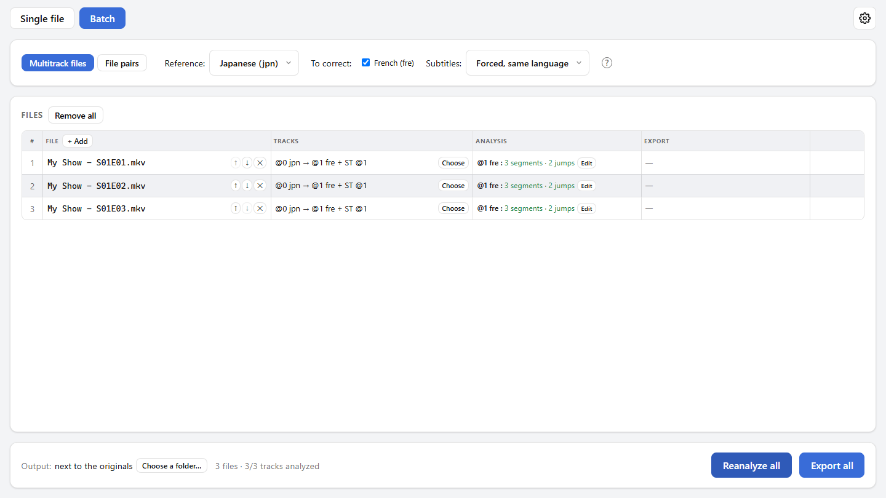

English | <a href="guide.fr.md">Français</a>

# User guide

This guide explains how to use SyncAudio, from opening a file to exporting it, one file at a time or in batch mode. For installing it, see the [README](../README.md#install).

## Contents

1. [Words to know](#words-to-know)
2. [One file at a time](#one-file-at-a-time)
3. [Reading the result](#reading-the-result)
4. [Correcting the segments by hand](#correcting-the-segments-by-hand)
5. [Exporting](#exporting)
6. [Subtitles](#subtitles)
7. [A whole series: batch mode](#a-whole-series-batch-mode)
8. [Options](#options)
9. [FAQ](#faq)

## Words to know

- **Reference**: the audio track that is in sync with the video, usually the original version. It is never changed: it's the one everything is lined up on.
- **Track to correct**: the out-of-sync track, usually a dub. It's the one SyncAudio puts back in sync with the reference.
- **Offset**: the gap between the two tracks at a given moment, in milliseconds. **+** means the track to correct is **late** on the reference, **−** that it's **early**.
- **Segment**: a stretch of the file over which the offset follows one rule. A file that is equally off from start to end has one segment; a file cut differently has several.
- **Constant, drift, jump**:
  - *constant*: the offset stays the same over the whole segment;
  - *drift*: it changes little by little (typically a different frame rate);
  - *jump*: it changes all at once between two segments (a scene longer or shorter in one version, an ad break).
- **Confidence**: how sure the detection of a segment is, from 0 to 100%. Below 40%, the segment is flagged **⚠ unreliable**.

## One file at a time

This is **Single file** mode, for a file that already holds the reference and the track(s) to correct (for instance an MKV with the original audio and a dub).

1. **Open the file** with "Open a file", or drop it on the window.
2. **Pick the tracks** in the table:
   - **Ref.** column: the reference track (the first one by default);
   - **To correct** column: the tracks to put back in sync (all the others by default).

   Meanwhile, "Preparing the tracks..." means SyncAudio is already reading the audio in the background, so the analysis starts sooner.
3. **Click "Analyze"**. Each ticked track shows up under "Analyzed tracks" with a summary: "3 segments · 2 jumps". Click a track to show its result on the right.
4. **Check the result** (see [Reading the result](#reading-the-result)), and correct it by hand if needed ("Edit segments").
5. **Export** with "Export the synchronized file".

<picture>
  <source media="(prefers-color-scheme: dark)" srcset="screenshots/main-en-dark.png">
  
</picture>

## Reading the result

### The offset chart

At the top right, the chart shows the offset (vertically) along the whole file (horizontally). The dashed "0 ms" line is the reference.

- Each segment is a line: **blue** when constant, **orange** when drifting.
- A **dotted** line is unreliable: worth checking by ear.
- A change of height between two lines is a **jump**.

### The waveforms

Below, three waveforms on the same time scale:

- **Reference**: the track that doesn't move.
- **Track to correct (as is)**: before correction. **Red** areas will be **removed**: content this version has in excess (a longer scene, for instance).
- **Final result**: what the export will hold. **Green** areas are **added silence**: content this version is missing.

The mouse wheel zooms under the pointer, "Whole track" goes back to the full view, and the bar at the bottom moves through the file. "Go to" jumps to a segment.

### Listening

"Play" plays a clip from the "Position". The **Hear** boxes pick what you hear: the reference, the track as is and the final result, in any combination.

The most telling is to hear the **reference with the final result**: when the correction is right, they sound like a single track, with no echo. With the track as is, you hear the original offset instead.

"Offset at this position" shows the correction applied where you're listening.

## Correcting the segments by hand

Detection relies on the sound both versions share (music, sound effects). Where there is none, it can get it wrong. "Edit segments" opens the editor to fix that.

<picture>
  <source media="(prefers-color-scheme: dark)" srcset="screenshots/editor-en-dark.png">
  
</picture>

In the chart:

- **Drag a segment** up or down to change its offset.
- **Drag a ● handle** to move the boundary between two segments.
- **Double-click** to split a segment in two there.
- **Click** to move playback there.
- The **mouse wheel** zooms, along with the waveforms on the right.

In the table, every value can also be typed in: start and end in seconds, offset at the start and at the end in milliseconds. A start offset different from the end offset makes a drift.

- **Remove** deletes a segment, typically a false detection: its neighbour extends over its duration, with its own offset. On hover, the result is previewed as green dots on the chart.
- **Remove unreliable segments** does the same for every ⚠ segment at once.
- **Undo / Redo** (Ctrl+Z / Ctrl+Y) and **Reset** (back to the state the editor opened with).
- **Save** keeps the changes; **Cancel** (or Esc) discards them, after confirming if there are any.

On the right, the same listening as outside the editor follows your changes live: it's the surest way to check a correction.

## Exporting

"Export the synchronized file" asks where to save the file. By default, it's next to the original, with the ".synced" suffix: `Film.mkv` gives `Film.synced.mkv`. The original file is never changed, and can't be picked as the destination.

The exported file is an **MKV** holding:

- the **video**, copied as is (not re-encoded, so no loss);
- the **reference track**, copied as is;
- each **corrected track**, re-encoded in its original format and bitrate. Two exceptions: AAC becomes Opus (the available AAC encoder is too slow), and formats with no encoder (TrueHD, DTS…) become lossless FLAC;
- the **subtitles** (see [Subtitles](#subtitles)).

The file's other audio tracks are left out. "Export content" (the "?" bubble) details what the file will hold.

Only the analyzed tracks **ticked** under "Analyzed tracks" are exported. They must all have been analyzed against the same reference.

An export in progress can be cancelled: no half-written file is left on disk.

## Subtitles

Subtitles timed on an audio track must get the same corrections as that track: otherwise, once the audio is back in sync, they would be off in turn. That's typically the case for a dub's **forced subtitles** (signs, lines in a foreign language), timed on the dub rather than on the video.

- **By default**, the forced subtitles in the same language as a corrected track are retimed with it. This can be changed in [Options](#options).
- In single-file mode, under each analyzed track, **"Also retime these subtitles"** ticks or unticks each subtitle track.
- Unticked subtitles are **copied as they are**, timed on the video.
- A subtitle track can be retimed with one audio track only.
- Only **text** subtitles (SRT, ASS) can be retimed. **Image** subtitles (PGS, VobSub) are always copied as they are.

## A whole series: batch mode

**Batch** mode processes every episode of a series in one pass. It has two modes, depending on how the files are organized.

| Your files… | Mode to pick |
| --- | --- |
| Each episode is a single file that already holds the original audio and the dub | **Multitrack files** |
| The original and the dub are in separate files (for instance `S01E01.mkv` and `S01E01.dub.ac3`) | **File pairs** |

In both modes:

- files are added with "+ Add" or by **dropping** them on the window. Dropping a **folder** adds its video and audio files in name order ("Episode 2" before "Episode 10");
- **Analyze all** starts the analysis. Afterwards, the button only analyzes what's missing (new files, failures) without losing your corrections; "Reanalyze all" starts over;
- **Edit** opens an episode's segment editor;
- **Output** picks where the exports go: next to the originals (with the ".synced" suffix), or into another folder (where each export keeps its original's name, unless that name is already taken there). The choice is remembered;
- **Export all** writes one file per episode, one at a time. "Cancel export" stops the one running and doesn't start the next ones.

### Multitrack files

<picture>
  <source media="(prefers-color-scheme: dark)" srcset="screenshots/batch-en-dark.png">
  
</picture>

Tracks are picked **by language**, for every file at once: the **reference** language at the top, then the languages **to correct**. That's more reliable than a track number, which can change from one episode to the next. When the first file is added, SyncAudio suggests its first track as the reference and every other language to correct.

- A file where a language is missing or appears more than once is flagged **⚠**: "Choose" sets its tracks (and subtitles) by hand, "By language" goes back to the automatic pick.
- The "Tracks" column sums up what will be done: `@0 jpn → @1 fre + ST @1` means "track 1 synced to track 0, with subtitle track 1".
- Each exported file holds all its corrected tracks.

### File pairs

Each row is a **pair**: on the left the **reference** file (the video with its original audio), on the right the file **to correct** (another video, or a bare audio file: WAV, FLAC, AC3, AAC…).

- Files are paired **in row order**: the ↑ ↓ arrows put a column back in the right order. When dropping files, the left half of the window adds them to the reference column and the right half to the column to correct.
- The tracks to use are picked at the top, from the first file of each column, and apply to every pair. "Check all tracks" shows each file's tracks, to make sure every episode is organized the same way.
- **Language**: the language given to the corrected track in the export. "The file's" keeps its own; picking one helps for an audio file that has none.
- **Subtitles**: the text subtitles of the file to correct, in its track's language, are imported and retimed with it (per the setting).
- The export starts from the reference file: its video, its reference track and its subtitles, plus the corrected track.

## Options

The **⚙** button at the top right opens Options:

- **Theme**: System (follows the system's light or dark theme), Light or Dark.
- **Language**: System (French if the system is in French, English otherwise), Français or English.
- **Default subtitles**: which subtitles are retimed with a corrected track unless picked otherwise. They're the ones ticked by default in single-file mode, and batch mode's starting setting.
- **Updates**: whether to check for a new version at startup.
- **Analysis cache**: SyncAudio keeps the analyses already made, so a reopened file shows up at once. "Clear" frees the space; files are just analyzed again.

When an update is available, an icon shows next to the ⚙: "Install and restart" downloads it, installs it and restarts the app. An analysis or export in progress is interrupted then.

## FAQ

**Windows says "Windows protected your PC" when installing.**
The installer isn't signed with a paid certificate. Click "More info", then "Run anyway".

**"Starting the engine..." shows at the top right.**
The analysis engine is starting in the background, usually in a second or two. Files can already be opened: their tracks show up as soon as it's ready.

**"The engine isn't responding".**
Click "Retry". If that's not enough, close and restart the app. If it keeps happening, an antivirus may be blocking the engine (on Windows, `engine\syncaudio-engine.exe` in the install folder).

**A segment is flagged ⚠ unreliable.**
The measurements disagree with each other over that stretch, or there are too few of them. It's common over a stretch with no music or sound effects (a narration, an inner voice): detection can then latch onto the dialogue, which is exactly what differs between two languages. Listen to it: if the offset sounds wrong, fix it in the editor or remove the segment.

**The result sounds like an echo.**
The offset is wrong there. Listen to the reference with the final result, find where the echo starts, and adjust the segments in the editor.

**Where are the analyses kept? How much space do they take?**
On Windows in `%LOCALAPPDATA%\SyncAudio\cache`, on Linux in `~/.cache/syncaudio`: 512 MB at most, the oldest ones being deleted beyond that. Options show their size and can clear them. Uninstalling removes them on Windows; on Linux, clear them from Options first.

**Is my original file changed?**
No, never. Exporting always writes a new file.

**My subtitles are off after exporting.**
They were probably timed on the corrected audio track rather than on the video: tick them under "Also retime these subtitles" (single file) or through "Choose" (batch), then export again. Image subtitles (PGS, VobSub) can't be retimed.
